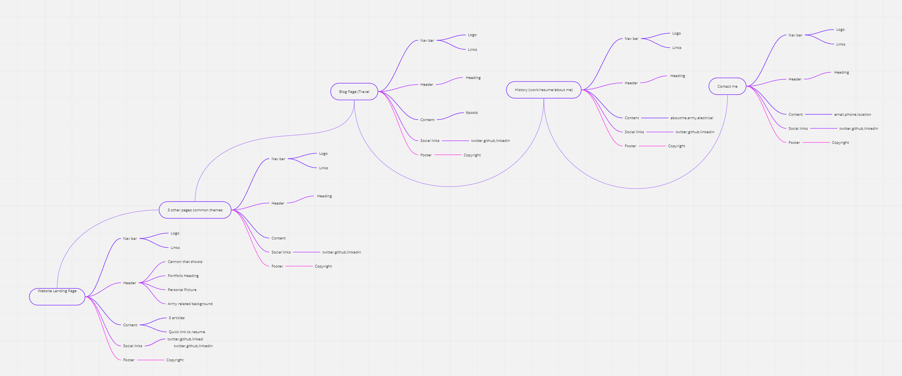
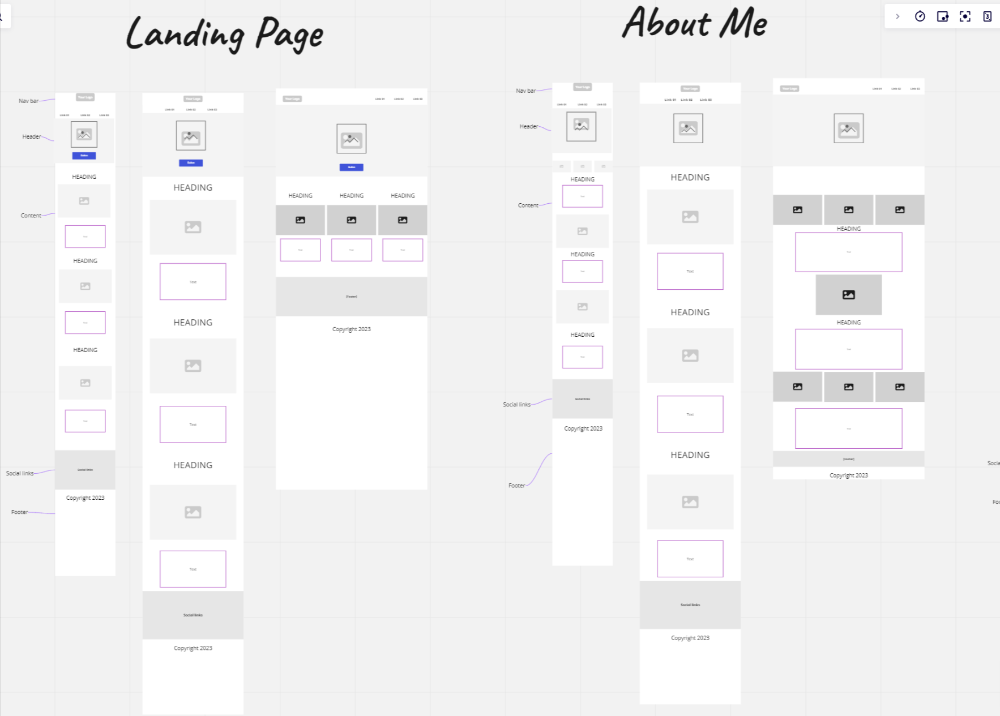
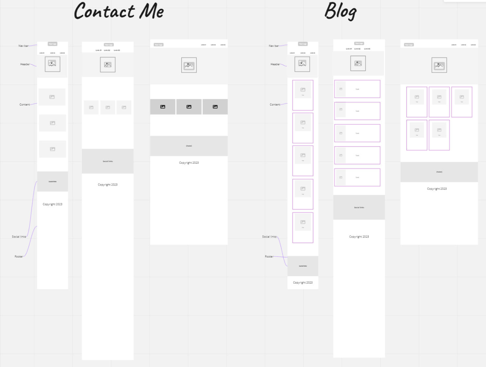
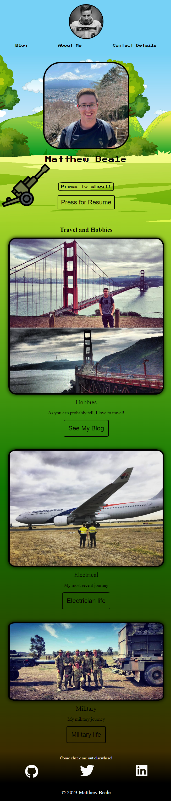
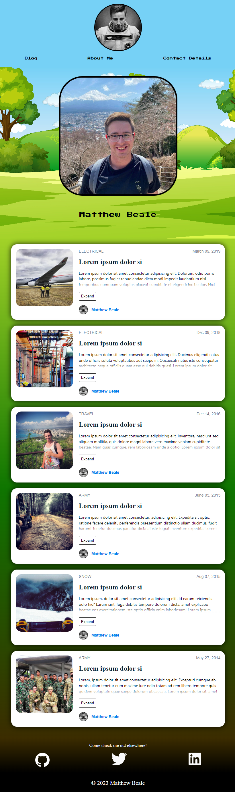
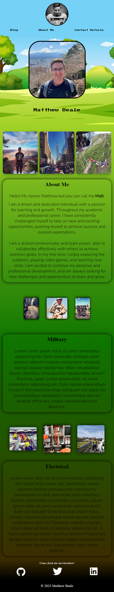
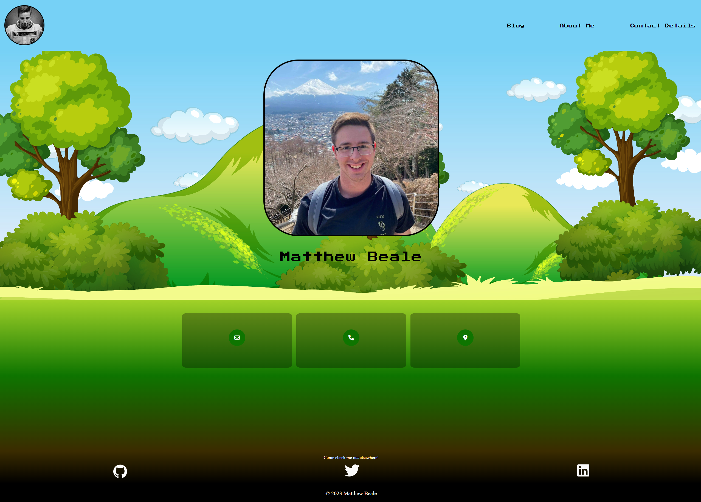
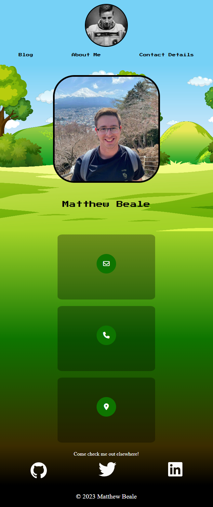

# My Portfolio Website

## Links

- [Portfolio Website](https://matthew-beale-t1-a2-7orl.vercel.app/)
- [GitHub Repo](https://github.com/mttble/MatthewBeale_T1A2)
- [Video Presentation](https://youtu.be/3T2t0UmPhvE)

## Description

### Purpose

The purpose of my portfolio website is to showcase my skills, experience, and projects to potential employers and clients.

### Functionality/Features

My portfolio website includes the following functionality and features:

- 'Home' page with a brief introduction and button for animation and resume.
- 'About me' page with my personal and professional information.
- 'Contact Details' page which allows visitors to contact me.
- A 'Blog' page which allows visitors to view my blog.
- Responsive design that works well on all devices.
- Numerous animations and features

### Target Audience

My portfolio website is aimed at potential employers, clients, and anyone who wants to learn more about my skills and experience.

### Tech Stack

My portfolio website was built using the following technologies:

- HTML
- CSS
- JavaScript
- Deployed on Vercel

### Sitemap

- Home
- Blog
- About Me
- Contact Details

### Screenshots

